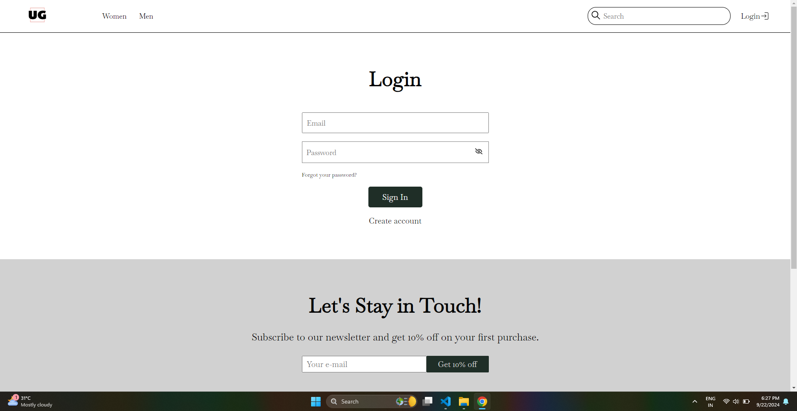
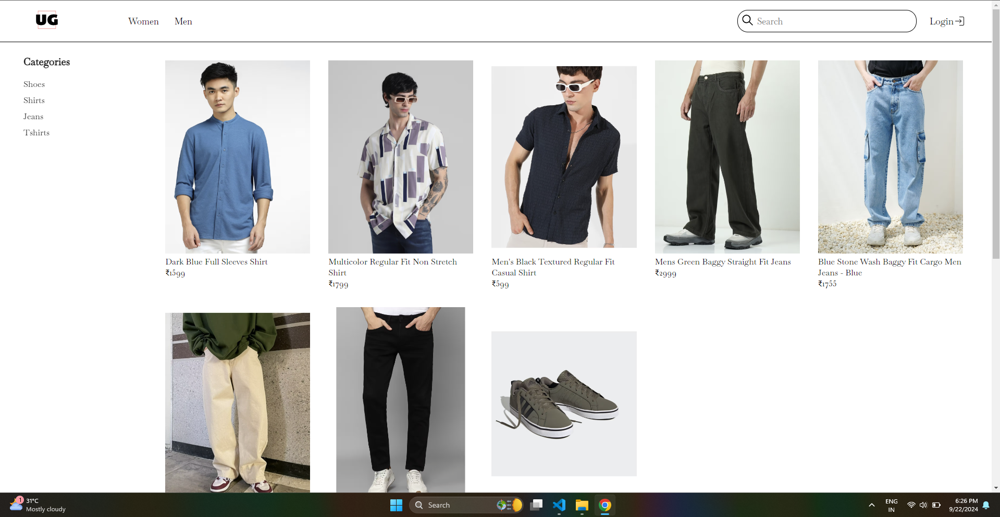
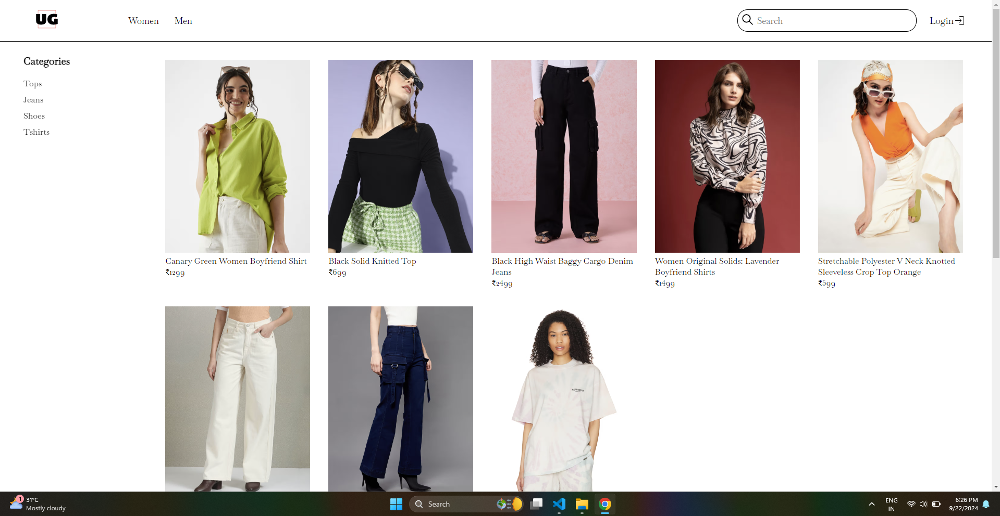
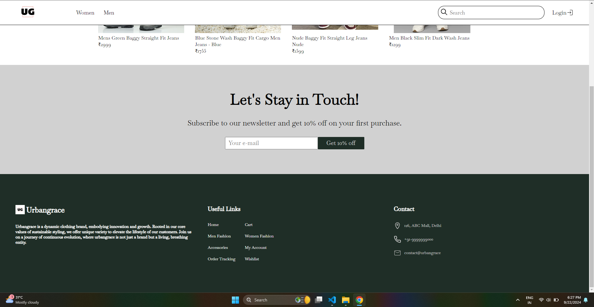

# 🛒 Minor Project (MERN Stack)

### **An E-commerce Platform**  
This e-commerce project was developed during my summer break after the 4th semester as a minor project. The goal of the project was to create a fully functional e-commerce platform where users can browse products, add items to the cart, and place orders. The project includes both a client (frontend) and a server (backend) component.

This README provides a detailed guide to running the project, along with key folder structure and some demo images.

---

## 🌟 Features
- User Authentication (Login, Registration, Password Recovery)
- Admin Dashboard for managing products, categories, and users
- Product Search and Filter
- Add to Cart, Checkout, and Order Management
- Responsive Design for both mobile and desktop
- Secure Payment Gateway Integration
- Image hosting with Cloudinary

---

## 🚀 Tech Stack
- **Frontend**: React, CSS, Context API
- **Backend**: Node.js, Express.js, MongoDB
- **Authentication**: JWT (JSON Web Token)
- **Deployment**: Vercel for Frontend, Heroku/Vercel for Backend
- **Image Storage**: Cloudinary

---

## 📂 Folder Structure

```plaintext
📦 Ecom_Project
├─ .DS_Store
├─ client
│  ├─ .gitignore
│  ├─ README.md
│  ├─ build
│  │  ├─ asset-manifest.json
│  │  ├─ favicon.ico
│  │  ├─ index.html
│  │  ├─ manifest.json
│  │  └─ static
│  │     ├─ css
│  │     │  ├─ main.bb74a88b.css
│  │     │  └─ main.bb74a88b.css.map
│  │     ├─ js
│  │     │  ├─ main.86fd298f.js
│  │     │  └─ main.86fd298f.js.map
│  │     └─ media
│  │        ├─ img1.avif
│  │        └─ img2.avif
│  ├─ public
│  │  ├─ favicon.ico
│  │  ├─ index.html
│  │  └─ logo.jpeg
│  └─ src
│     ├─ Components
│     │  ├─ Navbar.js
│     │  ├─ Product.js
│     │  ├─ Spinner.js
│     ├─ Pages
│     │  ├─ Home.js
│     │  ├─ Cart.js
│     │  └─ Login.js
│     ├─ App.js
│     ├─ index.js
│     └─ Styles
│        ├─ Home.css
│        ├─ Navbar.css
│        └─ Product.css
├─ server
│  ├─ config
│  │  ├─ cloudinary.js
│  │  └─ db.js
│  ├─ controllers
│  │  ├─ authController.js
│  │  ├─ productController.js
│  ├─ models
│  │  ├─ userModel.js
│  │  └─ productModel.js
│  ├─ routes
│  │  ├─ authRoute.js
│  │  ├─ productRoute.js
│  ├─ server.js
│  └─ vercel.json

```

---

## 🛠️ Installation & Setup Instructions

### **Prerequisites**
- [Node.js](https://nodejs.org/) installed
- [MongoDB](https://www.mongodb.com/) instance running

### **Clone the repository**
```bash
git clone https://github.com/anmol4khatri/Ecom_Project.git
cd Ecom_Project
```

### **Backend Setup (Server)**
1. Navigate to the server folder:
    ```bash
    cd server
    ```
2. Install the required dependencies:
    ```bash
    npm install
    ```
3. Create a `.env` file in the `server` directory and add the following environment variables:
    ```bash
    PORT=5000
    MONGO_URI=your_mongodb_connection_string
    JWT_SECRET=your_jwt_secret_key
    CLOUDINARY_URL=your_cloudinary_url
    ```
4. Start the backend server:
    ```bash
    npm start
    ```
    The server will start at `http://localhost:5000`.

### **Frontend Setup (Client)**
1. Open a new terminal and navigate to the client folder:
    ```bash
    cd client
    ```
2. Install the dependencies:
    ```bash
    npm install
    ```
3. Start the React frontend:
    ```bash
    npm start
    ```
    The frontend will start at `http://localhost:3000`.

---

## 📸 Project Demo

Here are some screenshots from the live demo of the E-commerce platform:











---

## 📊 Features Breakdown

- **User Side:**
  - Browse Products
  - Add to Cart & Checkout
  - Manage Orders

- **Admin Side:**
  - Create and Manage Products
  - View and Manage Orders
  - View Registered Users

---

## 📝 API Endpoints

### **Auth Routes**
- `POST /api/auth/register` - Register a new user
- `POST /api/auth/login` - Log in as a user
- `POST /api/auth/reset-password` - Reset password

### **Product Routes**
- `GET /api/products` - Fetch all products
- `GET /api/products/:id` - Fetch a single product
- `POST /api/products` - Add a new product (Admin only)

... _and many more_.

---

## 🎯 Future Enhancements
- Improve mobile responsiveness
- Add wishlists and product reviews
- Optimize for SEO

---

## 🎉 Contributing
Contributions are welcome! Feel free to submit a pull request or open an issue to suggest improvements.

---

## 📄 License
This is a personal project devloped by me and you must not copy this project.

---

### **Project By**:  
**Anmol**  
[LinkedIn](https://www.linkedin.com/in/anmolkhatri04/) | [GitHub](https://github.com/anmol4khatri)
